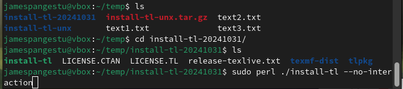
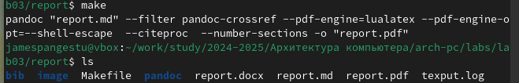

---
## Front matter
title: "Отчёт по лабораторной работе №3"
subtitle: "Дисциплина: Архитектура компьютера"
author: "Джеймс"

## Generic otions
lang: ru-RU
toc-title: "Содержание"

## Bibliography
bibliography: bib/cite.bib
csl: pandoc/csl/gost-r-7-0-5-2008-numeric.csl

## Pdf output format
toc: true # Table of contents
toc-depth: 2
lof: true # List of figures
lot: true # List of tables
fontsize: 12pt
linestretch: 1.5
papersize: a4
documentclass: scrreprt
## I18n polyglossia
polyglossia-lang:
  name: russian
  options:
	- spelling=modern
	- babelshorthands=true
polyglossia-otherlangs:
  name: english
## I18n babel
babel-lang: russian
babel-otherlangs: english
## Fonts
mainfont: PT Serif
romanfont: PT Serif
sansfont: PT Sans
monofont: PT Mono
mainfontoptions: Ligatures=TeX
romanfontoptions: Ligatures=TeX
sansfontoptions: Ligatures=TeX,Scale=MatchLowercase
monofontoptions: Scale=MatchLowercase,Scale=0.9
## Biblatex
biblatex: true
biblio-style: "gost-numeric"
biblatexoptions:
  - parentracker=true
  - backend=biber
  - hyperref=auto
  - language=auto
  - autolang=other*
  - citestyle=gost-numeric
## Pandoc-crossref LaTeX customization
figureTitle: "Рис."
tableTitle: "Таблица"
listingTitle: "Листинг"
lofTitle: "Список иллюстраций"
lotTitle: "Список таблиц"
lolTitle: "Листинги"
## Misc options
indent: true
header-includes:
  - \usepackage{indentfirst}
  - \usepackage{float} # keep figures where there are in the text
  - \floatplacement{figure}{H} # keep figures where there are in the text
---

# Цель работы

Здесь приводится формулировка цели лабораторной работы. Формулировки
цели для каждой лабораторной работы приведены в методических
указаниях.

Цель данного шаблона --- максимально упростить подготовку отчётов по
лабораторным работам.  Модифицируя данный шаблон, студенты смогут без
труда подготовить отчёт по лабораторным работам, а также познакомиться
с основными возможностями разметки Markdown.

# Задание

Здесь приводится описание задания в соответствии с рекомендациями
методического пособия и выданным вариантом.

# Теоретическое введение

Здесь описываются теоретические аспекты, связанные с выполнением работы.

Например, в табл. [-@tbl:std-dir] приведено краткое описание стандартных каталогов Unix.

: Описание некоторых каталогов файловой системы GNU Linux {#tbl:std-dir}

| Имя каталога | Описание каталога                                                                                                          |
|--------------|----------------------------------------------------------------------------------------------------------------------------|
| `/`          | Корневая директория, содержащая всю файловую                                                                               |
| `/bin `      | Основные системные утилиты, необходимые как в однопользовательском режиме, так и при обычной работе всем пользователям     |
| `/etc`       | Общесистемные конфигурационные файлы и файлы конфигурации установленных программ                                           |
| `/home`      | Содержит домашние директории пользователей, которые, в свою очередь, содержат персональные настройки и данные пользователя |
| `/media`     | Точки монтирования для сменных носителей                                                                                   |
| `/root`      | Домашняя директория пользователя  `root`                                                                                   |
| `/tmp`       | Временные файлы                                                                                                            |
| `/usr`       | Вторичная иерархия для данных пользователя                                                                                 |

Более подробно про Unix см. в [@tanenbaum_book_modern-os_ru; @robbins_book_bash_en; @zarrelli_book_mastering-bash_en; @newham_book_learning-bash_en].

# Выполнение лабораторной работы

4.1
Сначала хочу увидеть файл внутри файла texlive, который я только что скачал. Поскольку он сохранен в файле gzip, нужно открыть его с помощью команды :
Zcat (команда для просмотра содержимого gzip-файла непосредственно в терминале.) (рис. [-@fig:001]).

{#fig:001 width=70%}

4.2
теперь я нахожу файл, куда хочу texlive
мне необходимо установить Texlive через терминал с помощью следующий комманды с правами root :
Sudo perl .install-tl –no-interaction
полная установка может занять целый день.

{#fig:002 width=70%}

4.3
После завершения установки экспортируйте путь по следующему пути:

{#fig:003 width=70%}

4.4
затем нужно установить библиотеку pandoc с github с помощью следующей команды в терминале Linux:
wget

{#fig:004 width=70%}

4.5
pandoc-crossref — это фильтр для pandocs, и нужно установить его с помощью той же команды:
wget

{#fig:005 width=70%}

4.6
Теперь запускаю эти две команды, чтобы открыть файлы pandoc и pandoc-crossref, которые я только что скачал с помощью этой команды:

{#fig:006 width=70%}

{#fig:007 width=70%}

4.7
Теперь скопирую эти файлы по указанному пути как пользователь root:
Sudo cp

{#fig:008 width=70%}

{#fig:009 width=70%}

4.8 
Проверяю, успешно ли прошла установка, выполнив команду ls, чтобы распечатать файл внутри каталога file:

{#fig:010 width=70%}

4.9
после того, что все необходимые файлы скачали, начинаю выполнение лабораторной работы :
мы перейдем в каталог курса сформированный при выполнении лабораторной работы
№2.
мы запускаем следующие команды :
 cd ~/work/study/2023-2024/"Архитектура компьютера"/arch-pc/
 git pull
 cd ~/work/study/2023-2024/"Архитектура компьютера"/arch-pc/labs/lab03/report
 make

{#fig:011 width=70%}

{#fig:012 width=70%}

4.10
для того, чтобы запустил команду make, ещё нужно запустить эту команду, и только после этого команда работает :
sudo dnf install texlive-scheme-full
и потом запускаю команду :
make
При успешной компиляции команды make должен быть создан файл с именем report.pdf

{#fig:013 width=70%}

4.11
удаляю полученный файлы с использованием Makefile, Для этого введите команду
make clean

{#fig:014 width=70%}

открываю файл report.md с помощью текстового редактора gedit, и запускаем команду :
gedit report.md

{#fig:015 width=70%}

4.12
Я редактирую шаблон Л03_Джеймс_отчет.md с помощью Markdown, сохраняю и проверяю еще раз с помощью команды :
ls

{#fig:016 width=70%}

4.13
Я запускаю команду make еще раз, чтобы создать Л03_Джеймс_отчет.pdf и Л03_Джеймс_отчет.docx, проверяю правильность создания иерархии рабочего пространства в локальном репозитории.

{#fig:017 width=70%}

4.14
Добавляю изменения на GitHub с помощью комнадой git add и сохраняю изменения с помощью commit

{#fig:018 width=70%}

4.15
Отправлялю файлы на сервер с помощью команды git pull

{#fig:019 width=70%}

# Выводы

В результате выполнения данной лабораторной работы я освоил процедуры
оформления отчетов с помощью легковесного языка разметки Markdown.

# Список литературы{.unnumbered}

::: {#refs}
:::
